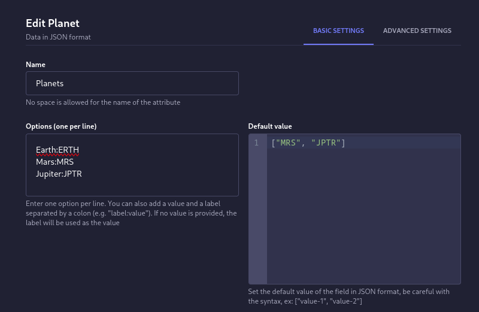
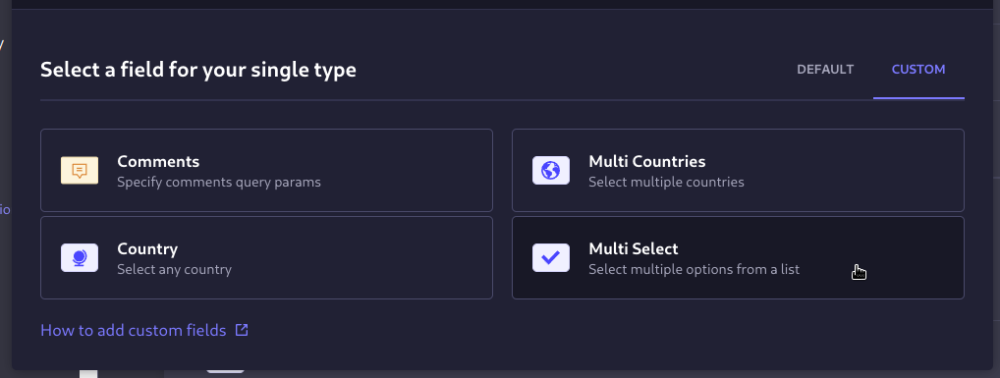
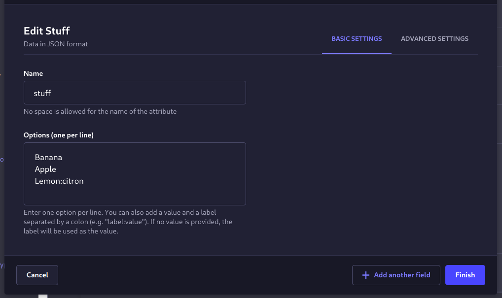
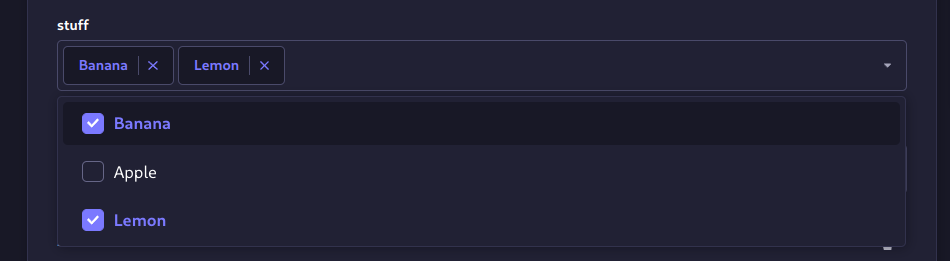

# Strapi plugin multi-select

A strapi custom field for selecting multiple options from a provided list of items.

### CHANGELOG
**2.1.0**
- Add default value support [#16](https://github.com/Zaydme/strapi-plugin-multi-select/issues/16)
- Add Min and Max selection limits



**2.0.1**
- Preserve selection order when displaying previously selected options [#21](https://github.com/Zaydme/strapi-plugin-multi-select/issues/21)

**2.0.0**
- Migrated to Strapi v5, and the new plugin structure
- Now using @strapi/sdk-plugin
- Migrated to TypeScript

**1.2.2** Support colons in option values, only first colon is used as separator 

> example usage: `this_is_label:all:of:this:is:value`

**1.2.1** Localize option label

> example usage: `my.custom.translations.key:value`


**1.2.0** Replace strapi select with react-select


## Installation

To install this plugin, you need to add an NPM dependency to your Strapi application:

```
# Using Yarn
yarn add strapi-plugin-multi-select

# Or using NPM
npm install strapi-plugin-multi-select
```

Then, you'll need to build your admin panel:

```
# Using Yarn
yarn build

# Or using NPM
npm run build
```

## Usage

After installation you will find the multi-select at the custom fields section of the content-type builder.



You add options to the multi-select by adding a line separated list of options to the options field.

You can also add a value and a label separated by a colon (e.g. `label:value`). If no value is provided, the label will be used as the value.



then you can select one or more options from the list.



in this case the API will return

```json
{
  "data": {
    "id": 1,
    "attributes": {
      "stuff": ["Banana", "citron"]
    }
  }
}
```

---

You can also check the [multi-country-select](https://github.com/zaydme/strapi-plugin-multi-country-select) plugin
